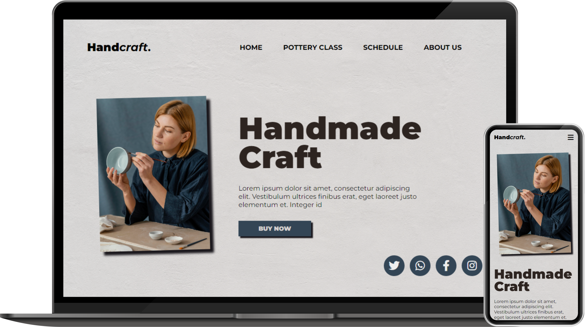

# Handcraft

## O site

> [Link do site](https://diaspaulo.github.io/handcraft/site)

Este projeto foi desenvolvido com intuito de praticar os conhecimentos adquiridos em HTML, CSS e Javascript. A inspiração para este projeto foi retirado do site
[freepik](https://br.freepik.com/).

Foi utilizado como inspiração o modelo disponível [aqui](https://br.freepik.com/psd-gratuitas/modelo-de-pagina-de-destino-de-arte-e-artesanato_13271491.htm). Além disso, foi realizada a idealização para a platafoma mobile. 

## Tecnologias

<!-- Desenvolvido utilizado as tecnologias HTML, CSS e Javascript. -->

